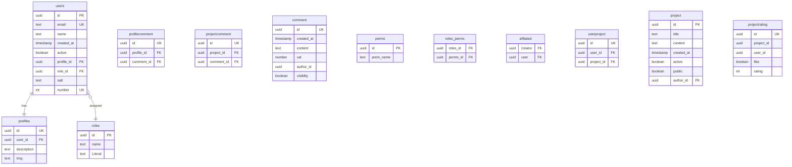
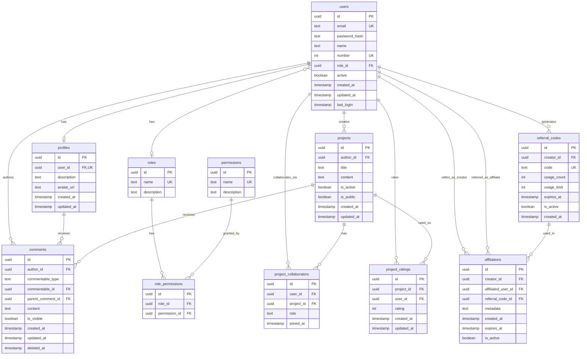

# Users & Posts Schema

## Overview
This document describes the database schema for users and their posts.

- A user can create many posts
- A post belongs to exactly one user

---

## Tables

### Users

**Description**  
Stores application users.

**Columns**
- `id` (uuid, PK)
- `email` (text, unique)
- `name` (text)
- `created_at` (timestamp)

---

### Posts

**Description**  
Stores user-generated posts.

**Columns**
- `id` (uuid, PK)
- `user_id` (uuid, FK → users.id)
- `title` (text)
- `content` (text)
- `created_at` (timestamp)

---

## Relationships
- `users` **1 → N** `posts`
- `posts.user_id` references `users.id`

---

## ER Diagram

